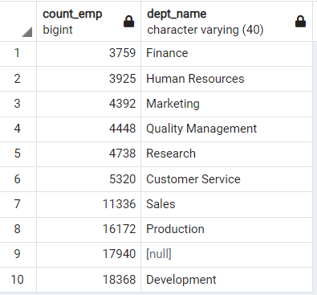

# Pewlett-Hackard-Analysis
Weekly Challenge 7 - To get the number of retiring employees using SQL

## Overview of the Project

### Purpose and Backgroud
We have performed our analysis for Pewlett-Hackard to get the number of employees who will be retiring and also compute how many positions need to be filled in the
near future. The upcoming retirement of the employees will leave thousands of job openings which the company should be well prepared before hand. So to prepare the
company for this "Silver Tsunami" we need to perform our analysis to get all the employees eligible for retirement. Also we will further aggregate our data and do
useful computations using SQL and retrieve information from company's database .Using employees database and also the database related to different departments and 
roles in the company we can get all necessary information and make a future proof plan for this Silver Tsunami that the comapny is going to face in near future.
We will also create a mentorship database that will constitute of all the current experienced and successful employees who will mentor the newly hired folks in
the company.

## Results
- Firstly we created a retirements_titles table as given below which consists the list of all the employees who are going to retire from the company. We calculated 
  this based on the birth date of all the employees who were born between 1952 and 1955. We have the information for the roles or designations they were assigned to
  throughout their service in the company.
  
  [retirement_titles](./Data/retirement_titles.csv)
  
- There are many employees who got promoted to a different role in their enitre years of service and we have all the titles of each employee in the previous table.
  Since we only want the current roles that are going to be open after the retirement of the employees, we created a table with unique titles which shows the
  current titles of each employee who will be retiring. For this we used DISTINCT ON that will return only a single row based on the order by condition we are
  providing in SQL. So we used 'to_date' column in order by clause, arranged in descending order to get the current title of each employee. This table is given 
  below:
  
  [unique_titles](./Data/unique_titles.csv)
  
- To get the count of openings we need to get the count of employees retiring against each position or title that we have calculated in the table below. We have used 
  group by clause to get the retitring employees count for each position. As we can see from the table below the maximum positions that needs to be filled will be 
  for Senior Engineer post(29,414) followed by Senior Staff(28,254).
  
  [retiring_titles](./Data/retiring_titles.csv)
  
 - Also for the mentorship program where all the experienced and successful employees of the company will mentor the newly hired folks we will crate a mentorship
   eligibility table as shown below. They will have all the current employees whose birth year is 1965 and are ready to mentor the future genertaions of the 
   company. They are currently working in one of the departments.
   
   [mentorship_eligibilty](./Data/mentorship_eligibilty.csv) 
  
  ## Summary

1. How many roles will need to be filled as the "silver tsunami" begins to make an impact?

   A total of 90,398 positions need to be filled as the retirement-age ready employees are going to retire from the company. As we can see from above tables
  most number of senior engineers are going to retire with a maximum count of 29,414. 
  
  
2. Are there enough qualified, retirement-ready employees in the departments to mentor the next generation of Pewlett Hackard employees?
 
    
   
   As we can see from the table above the count of employees from each department who will be attending the mentorship programme.The number of employees from the
   finance department is fairly low . So we can find some way to get some of the current employees from finance department who are successful and experienced and who
   can mentor the other new employees. Same goes for the Quality management , HR ,Research, Marketing and Customer service departments . As the number of positions
   that needs to be filled is huge , so we also need a good number of the mentors from each department who will be a good fit for this job.
   The departments of each employee eligible for mentorship is shown in the following table :
   
    [mentorship_dept](./Data/mentorship_dept.csv)
	
   
3. We have also found out the departments in which the employees who are retiring are currently working. The following table gives us the department name of
    each retiring employee :

	[titles_dept](./Data/titles_dept.csv)
	
4. Following table gives the total count of employees retiring from each department and also the total number of postions to be filled in each department:

     